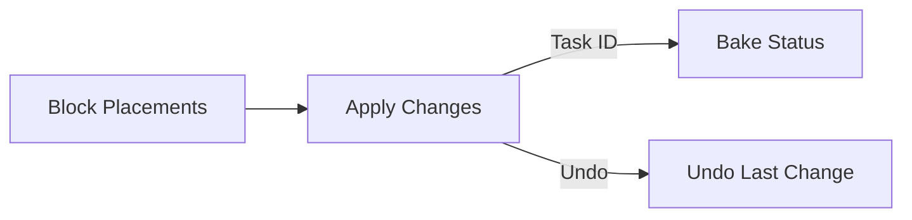

# output.execute — 执行与烘焙

Apply / 状态查询 / 撤销重做 / 预览清理 / SDF 体素 / 放置合并。

```mermaid
flowchart LR
  Place[Block Placements] --> Apply[Apply Changes]
  Apply -->|Task ID| Status[Bake Status]
  Apply -->|Undo| Undo[Undo Last Change]
```
