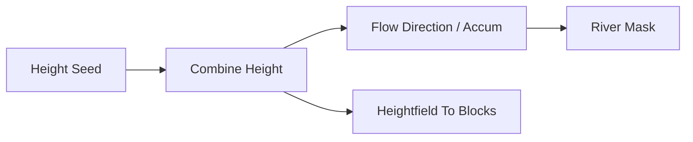

# world.terrain — 地形场

高度/板块/侵蚀/气候场 → 采样与转方块放置。

```mermaid
flowchart LR
  Seed[Height Seed] --> Combine[Combine Height]
  Combine --> Flow[Flow Direction / Accum]
  Flow --> River[River Mask]
  Combine --> Blocks[Heightfield To Blocks]
```
