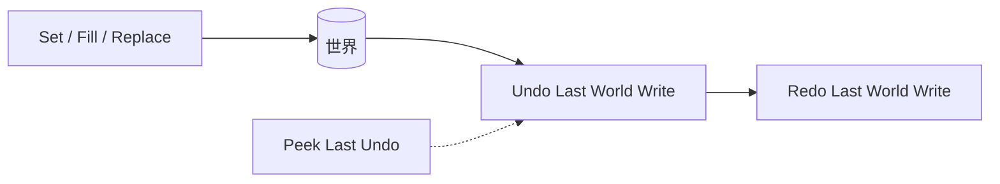

# world.write — 写入世界

放置/填充/替换/克隆、实体、告示牌、红石、命令，以及 write 专用撤销栈。

> 与 `output.execute.Apply Changes` 的烘焙历史分开；本分类有独立 undo/redo。

```mermaid
flowchart LR
  Set[Set / Fill / Replace] --> World[(世界)]
  World --> Undo[Undo Last World Write]
  Undo --> Redo[Redo Last World Write]
  Peek[Peek Last Undo] -.-> Undo
```
